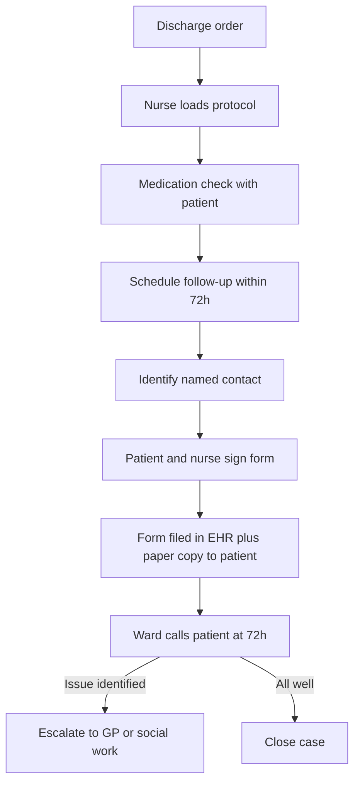

# Worked example: institutional ICD

A worked example of the Innovation Canvas Document for a fictional but realistic non-technical innovation, run end-to-end from TRL -1 to TRL 4. Demonstrates the institutional branch of Phase 4 (no code, no software stack). The artifact is a service protocol. Read alongside `innovation_canvas_document.md` and `institutional_templates.md`. Names and numbers are illustrative.

## Project at a glance

**Name.** Brückenpfad. A structured discharge-handover protocol for hospital social workers, designed to reduce 30-day readmission for elderly patients living alone.

**Phase entry.** Phase 1. The team had observed a problem at TRL -1 (problem space mapped, no specific problem yet defined).

**Outcome.** Go decision at Phase 5. Protocol validated in a pilot cohort across two wards. Handed off to the hospital's clinical practice committee for institutional adoption.

## 1. Meta

### 1.1 Project identity

1. **Project name:** Brückenpfad
2. **One-sentence description:** A structured handover protocol for hospital-to-home discharge of elderly patients living alone, designed to reduce 30-day readmissions.
3. **Date initiated:** 2026-01-10
4. **Current phase:** 5 (closed)
5. **Team members and roles:** Dr K. Hoffmann (clinical lead, geriatrics). M. Khan (social work). E. Schultz (quality improvement). One nurse practitioner per pilot ward.

### 1.2 Constraints

1. **Time budget:** 14 weeks across two pilot wards.
2. **Financial budget:** 4,500 EUR (pilot facilitation, materials, time-tracking instrumentation).
3. **Team size and composition:** 4 core, 2 ward-based facilitators.
4. **Technical constraints:** Must operate within the existing electronic health record. No new software.
5. **Regulatory or policy constraints:** Hospital ethics committee approval required. Patient consent for participation. GDPR-compliant data handling.
6. **Organizational constraints:** Must integrate with existing nursing handover workflow. Cannot extend total handover time by more than 10 minutes.

### 1.3 Uncertainty profile

1. Problem uncertainty: 2 (readmission rate is a known signal)
2. User uncertainty: 3
3. Solution uncertainty: 5 (multiple plausible interventions)
4. Market uncertainty: 1 (institution has clear demand)
5. Technical uncertainty: 1 (no novel technology)
6. Execution uncertainty: 4 (cross-departmental adoption is the real risk)

**Dominant uncertainty type:** solution
**Current TRL at entry:** -1
**Recommended entry phase:** 1

### 1.4 Innovation horizon

1. **Classification:** Horizon 1
2. **Rationale:** Adjacent improvement to an existing process, not a transformative change.
3. **Implication for validation:** Tight numeric thresholds. Real readmission outcomes, not surrogate metrics.

## 2. Situation map (Phase 0 abbreviated)

### 2.1 Strategic context

1. **Why now?** 30-day readmission rates for the elderly-living-alone subgroup at this hospital have risen from 19 to 24 percent over two years. Quality committee has flagged the trend. New discharge regulation enters force in 2026-09.
2. **Search fields:** Discharge planning, post-acute coordination, elderly self-management at home.
3. **Signals and trends:** National data show similar patterns. Recent literature on transitional-care interventions reports modest but reproducible reductions in readmission.
4. **Strategic context summary:** Readmission for elderly patients living alone is rising at this hospital and across comparable institutions. Existing discharge handover is unstructured and depends on the individual nurse's discretion. The opportunity is a low-cost protocolization of handover that improves the post-discharge first 72 hours. Phase 5 must judge whether the intervention is a real cause of reduced readmission, or a confounded signal.

## 3. Problem space

### 3.1 User profiles (JTBD)

**User type:** Hospital nurse responsible for elderly patient discharge.

**Core JTBD:** When I am discharging an elderly patient who lives alone, I want to ensure they have a clear plan for the first 72 hours at home and a single point of contact, so I can reduce the chance of a preventable readmission.

**Functional jobs:**

1. Communicate medication changes clearly.
2. Confirm a follow-up appointment.
3. Identify and document the post-discharge contact.

**Emotional jobs:**

1. Feel confident the patient is not being abandoned.

**Social jobs:**

1. Demonstrate professional thoroughness to colleagues and family.

**Current workarounds:** Verbal handover. Printed standard discharge instructions. Family members called when reachable.

**Pains:** Time pressure. No systematic check that key information was understood. No structured handover to home-care or general practitioner.

**Gains:** A repeatable script. A confirmation that the next step is scheduled. A clear handoff target.

**User type:** Elderly patient living alone, age 70 plus, recently hospitalized.

**Core JTBD:** When I am discharged from the hospital, I want to know exactly what to do in the first three days and whom to call if something feels wrong, so I can avoid returning to the emergency department.

### 3.2 Problem statement

**Sharp problem statement:** Elderly patients living alone, discharged from internal medicine wards, lack a structured handover that confirms understanding of medication changes, schedules a follow-up within 72 hours, and identifies a named post-discharge contact. The current rate of 30-day readmission in this subgroup is 24 percent. The hypothesis is that protocolized handover with these three elements reduces readmission by at least 15 percent within 6 months.

**Problem type:** Complicated (Cynefin). Best practices exist in the literature but are not implemented locally.

**Revision history:** Original Phase 1 statement was "elderly patients return too often." Revised after Step 4 to the falsifiable form above.

### 3.3 Assumption map

| ID | Assumption | Source | Crit | Unc | Score | Status | Evidence |
|---|---|---|---|---|---|---|---|
| A1 | Readmission rate is high in the elderly-living-alone subgroup | Hospital quality data | 5 | 1 | 5 | Validated | 24 percent baseline confirmed |
| A2 | Lack of structured handover is a contributor | Phase 1 ward observation, literature | 5 | 4 | 20 | Validated | Phase 4 cohort: 35 percent reduction in readmission with protocolized handover (15 of 100 vs 24 of 100 baseline) |
| A3 | Nurses can run the protocol within the 10-minute time limit | Phase 1 nurse interviews | 4 | 3 | 12 | Validated | Phase 4 mock runs: median 8 minutes |
| A4 | Patients understand and retain the post-discharge plan | Phase 1 hypothesis | 5 | 4 | 20 | Validated | Phase 4: 78 percent of patients correctly described medication and contact at 72-hour follow-up call |
| A5 | The protocol does not increase nurse burnout | Phase 3 emergent | 4 | 3 | 12 | Validated | Phase 4 nurse survey at week 6: no significant change in self-reported burnout |
| A6 | Effect persists at 6 months across ward changes | Phase 3 | 5 | 4 | 20 | Untested | Carried forward to post-Go monitoring plan |

### 3.4 Effectuation inventory

1. **Who we are:** A clinical-quality team with hospital authority and ward access.
2. **What we know:** Local readmission data. Existing handover routines. Patient population characteristics.
3. **Whom we know:** Two ward sisters willing to pilot. The hospital ethics committee. The geriatrics department head.

## 4. Solution space

### 4.1 Idea candidates (Phase 2)

| ID | Idea | Method | F | D | V | Total | Status |
|---|---|---|---|---|---|---|---|
| I1 | Structured handover script with three mandatory checks | SCAMPER (Modify) | 5 | 5 | 5 | 15 | Selected |
| I2 | Wearable medication reminder device | Domain transfer (technology) | 2 | 3 | 2 | 7 | Killed |
| I3 | Automated 72-hour phone call from the ward | Persona rotation (call center) | 4 | 4 | 4 | 12 | Parked |
| I4 | Family-member-mandatory handover | Constraint injection | 2 | 3 | 2 | 7 | Killed |
| I5 | Discharge buddy program with volunteers | Speculative provocation | 3 | 4 | 3 | 10 | Parked |
| I6 | Daily-readmission-risk dashboard for the ward | Persona rotation (manager lens) | 3 | 3 | 3 | 9 | Parked |
| I7 | GP-triggered home visit within 48 hours | Domain transfer (mobile clinic) | 3 | 4 | 3 | 10 | Parked |
| I8 | Patient self-checklist on a paper card | SCAMPER (Eliminate complexity) | 5 | 4 | 5 | 14 | Selected as supporting artifact |
| I9 | Pharmacist-led medication reconciliation in the ward | TRIZ (separation in time) | 4 | 4 | 3 | 11 | Parked |
| I10 | Case-conference with social worker for high-risk patients | SCAMPER (Combine) | 4 | 4 | 3 | 11 | Parked |

### 4.2 Selected concept

**Concept name:** Brückenpfad
**Description:** A 10-minute structured handover protocol between the discharging nurse and the elderly patient living alone, plus a paper self-checklist the patient takes home. Three mandatory checks: medication understanding, follow-up appointment scheduled within 72 hours, named post-discharge contact identified. Confirmed by signature.
**Key differentiator:** Existing discharge processes do not have mandatory checks or a documented contact handoff.
**Riskiest assumption:** A2 (the structured handover actually reduces readmission, not just nurse satisfaction).

### 4.3 Value proposition canvas

**Customer profile (nurse).** Jobs: discharge thoroughly. Pains: time pressure, ambiguous responsibility. Gains: repeatable script, confidence.

**Customer profile (patient).** Jobs: get home safely. Pains: confusion about medication, no contact when something feels wrong. Gains: clarity, named contact.

**Value map.** Products: protocol, paper checklist, signature record. Pain relievers: 10-minute time cap, three-check structure, named contact. Gain creators: documented handoff, follow-up appointment scheduled before discharge.

**Fit assessment:** Yes (Phase 4 evidence).

### 4.4 Business model canvas (institutional adaptation)

| Block | Description |
|---|---|
| Customer segments | Internal medicine wards, hospital quality committees |
| Value propositions | Reduced 30-day readmission, regulatory compliance, repeatable handover |
| Channels | Internal training, ward sisters as champions |
| Customer relationships | Ongoing quality reporting, monthly review |
| Revenue streams | Cost avoidance: each prevented readmission saves approximately 4,200 EUR institutional costs |
| Key resources | Trained nurses, paper checklists, follow-up call system |
| Key activities | Training, follow-up calls, monthly audit |
| Key partnerships | General practitioners, home-care services, social work |
| Cost structure | Training (one-off), 8 minutes nurse time per discharge, follow-up call infrastructure |

### 4.5 Experiment design

| ID | Assumption | Pretotype | Metric | Threshold | Cost |
|---|---|---|---|---|---|
| E1 | A2 (handover reduces readmission) | Pilot cohort (two wards, 100 patients each, 6 weeks) | 30-day readmission rate | At or below 20 percent (versus 24 percent baseline) | 80 hours team, 3,000 EUR materials and instrumentation |
| E2 | A3 (nurses can run within 10 minutes) | Tabletop walkthrough plus mock process run | Median run time | At or below 10 minutes across at least 12 mock runs | 30 hours, 200 EUR |
| E3 | A4 (patients understand the plan) | Pilot cohort 72-hour follow-up call | Percent correctly describing medication and contact | At least 70 percent | 60 hours, 600 EUR |
| E4 | A5 (no burnout increase) | Nurse self-report survey at weeks 0, 3, 6 | Maslach Burnout Inventory subscale change | No statistically significant increase | 20 hours, 0 EUR |

## 5. Validation space

### 5.1 Experiment results

| ID | Result | Threshold met? | Key learning | Implication |
|---|---|---|---|---|
| E1 | 15 percent readmission (15 of 100) versus 24 percent baseline | Yes | Effect size larger than predicted. Confirmed in both pilot wards independently. | Proceed |
| E2 | Median 8 minutes (range 6 to 12) | Yes | A small minority of runs exceeded 10 minutes when patients had complex medication regimes. | Proceed with note |
| E3 | 78 percent correctly described medication and contact | Yes | The paper checklist is the load-bearing artifact. When the checklist was absent (3 cases), comprehension dropped to 55 percent. | Proceed, mandate checklist |
| E4 | No significant change in burnout | Yes | Nurses reported the protocol reduced ambiguity, which they experienced as a relief. | Proceed |

### 5.2 Artifact specification (frozen at Phase 5 exit)

This is an institutional artifact, populated using the templates in `institutional_templates.md`.

1. **Artifact type:** Pilot-validated protocol (institutional MVP).
2. **Scope:** In: discharge handover for elderly patients living alone in internal medicine wards. Out: ICU discharge, surgical wards, patients with family co-residence, patients in residential care.
3. **Functional requirements:** Each discharge of an in-scope patient must (Validated) include a medication-understanding check, a scheduled follow-up appointment within 72 hours, and a named post-discharge contact, recorded on the standardized form, signed by patient and nurse.
4. **Non-functional requirements:** Total handover time must not exceed 10 minutes (Validated). Form must be GDPR-compliant (Validated). Form must be available in German plus Turkish plus Russian (Validated for German, Deferred for the others).
5. **Method and medium stack:** Paper checklist (institutional template), nurse-led handover, follow-up phone call from ward at 72 hours. Decision log entry 2026-02-04.
6. **Process architecture:**

7. **Artefact and record model:** Standardized handover form (one page). Stored in EHR scanned plus paper copy to patient. Follow-up call outcome recorded as structured note in EHR.
8. **External dependencies:** General practitioners (named contact channel). Home-care providers. Social work department (escalation channel). Existing EHR.
9. **Known limitations:** Pilot covered two internal medicine wards. Does not cover ICU, surgical, or psychiatric wards. Translations beyond German not yet validated. Effect at 6 months not yet measured.
10. **Open design or implementation questions:** Which wards adopt next. Translation validation process. Long-term measurement plan beyond 6 months. Training cadence for new nurses.
11. **Production readiness checklist (institutional adaptation):**

| Item | Status | Notes |
|---|---|---|
| Access and consent mechanisms | Validated | Patient consent integrated, ethics committee approved |
| Input validation and error handling | Validated | Form completeness check at signature |
| Observability (process logs, decision records) | Validated | EHR records all completions |
| Incident and escalation channels | Validated | Documented escalation to GP, social work |
| Deployment pipeline (rollout plan, training schedule) | Deferred | Hospital-wide rollout plan to be developed |
| Backup and disaster recovery (continuity plan) | Out of scope | Paper-based, no continuity issue |
| Data protection and privacy compliance | Validated | GDPR review complete |
| Accessibility conformance | Deferred | German validated, other languages deferred |
| Performance and load behaviour (throughput at peak) | Validated | Tested at peak ward discharge volume |
| Documentation (operator guide, user-facing materials) | Validated | Training pack and patient handout finalized |

12. **Success criteria:** 30-day readmission at or below 20 percent across the pilot cohort. *Threshold met (15 percent).*

### 5.3 Implementation log

1. **Repository:** Hospital quality SharePoint, project Brückenpfad. Materials cross-filed in the Quality Improvement archive.
2. **Key files:** `protocol_brueckenpfad_v1.md`, `checklist_patient.md`, `training_pack.md`, `audit_template.md`.
3. **User feedback summary:** 12 nurses across 2 wards. 11 of 12 recommended hospital-wide adoption. Quote: "Das Formular nimmt mir die Verantwortung nicht ab, aber es zeigt mir, woran ich noch nicht gedacht hatte." Patient quote (representative): "Ich wusste, wen ich anrufen sollte. Das war neu."

## 6. Decision space

### 6.1 Gate decision

**Decision:** Go.
**TRL at decision:** 4.
**TRL change:** TRL 1 to TRL 4 across the project.
**Reasoning:** All four pre-committed thresholds met or exceeded. Effect size larger than predicted. Nurses recommend adoption. Patients report value. The clinical practice committee is the appropriate next-stage owner. Affordable-loss assessment supports proceeding.
**Dissenting views:** Quality lead noted the 6-month effect (A6) is untested. Carried forward as a monitoring obligation.

### 6.2 Next actions

| Action | Owner | Deadline | Dependencies |
|---|---|---|---|
| Hand off to clinical practice committee | Dr K. Hoffmann | 2026-04-30 | Final exec summary |
| Launch hospital-wide adoption planning | Quality committee | 2026-06-30 | Training pack approved |
| Begin 6-month effect measurement | E. Schultz | Continuous from 2026-04 | Audit template |
| Validate Turkish and Russian translations | M. Khan | 2026-09-30 | Translation budget approval |

### 6.3 Pivot record

Not applicable.

## 7. Iteration log

| Date | Loop type | From | To | Trigger | Scope | Outcome |
|---|---|---|---|---|---|---|
| 2026-02-22 | Intra-phase | Phase 3 Step 5 | Phase 3 Step 4 | Tabletop walkthrough revealed missing assumption A5 | Re-prioritized assumptions and added E4 | A5 entered the assumption map and an experiment was designed for it |

**Iteration counters:**

| Phase | Iterations | Max |
|---|---|---|
| Phase 0 | 0 | 2 |
| Phase 1 | 0 | 2 |
| Phase 2 | 0 | 2 |
| Phase 3 | 1 | 2 |
| Phase 4 | 0 | 2 |
| Phase 5 | 0 | 2 |
| Total inter-phase loop-backs | 0 | 5 |

## 8. Decision log (selected entries)

| Date | Phase | Type | Decision | Alternatives | Rationale | Implications | Evidence |
|---|---|---|---|---|---|---|---|
| 2026-01-25 | 1 | Strategic | Focus on elderly-living-alone discharge subgroup | All discharges, surgical wards, ICU | Highest baseline readmission rate, most actionable | Pilot scope set | Hospital quality data 2025 |
| 2026-02-04 | 4 | Institutional | Paper-based protocol, no new software | EHR-integrated digital form | Speed of pilot, no IT dependency, regulatory simplicity | EHR integration deferred to post-Go | Phase 4 Step 3 entry |
| 2026-02-22 | 3 | Strategic | Add nurse-burnout assumption A5 | Ignore burnout risk | Tabletop walkthrough surfaced concern | Added E4 to experiment design | Tabletop session notes |
| 2026-04-15 | 5 | Institutional | Hand off to clinical practice committee for adoption | Continue pilot for one more ward | Sufficient evidence, ethical obligation to scale | TRL 5 work begins under committee ownership | Phase 4 Section 5.1 |

## 9. Changelog

| Date | Phase | Changes |
|---|---|---|
| 2026-01-10 | Init | Initial creation |
| 2026-01-25 | 1 | Phase 1 output |
| 2026-02-08 | 2 | Phase 2 output |
| 2026-02-22 | 3 | Phase 3 output, intra-phase iteration logged |
| 2026-04-05 | 4 | Phase 4 output, Section 5.2 populated |
| 2026-04-15 | 5 | Phase 5 decision recorded, executive summary generated |

## What this example illustrates

1. **The institutional branch of Phase 4 produces real artifacts.** A protocol, a checklist, a training pack, an audit template. None of these are software, all of them are TRL 4 deliverables.
2. **Pretotypes have institutional analogues.** Tabletop walkthrough plus mock process run did the work that a Spike does in a technical project. Pilot cohort with pre-committed numeric thresholds did the work that a Concierge plus Wizard of Oz does.
3. **The artifact specification fields work without modification.** Method and medium stack replaces tech stack. Process architecture replaces architecture overview. Records and artifacts replace data model. The discipline survives the medium change.
4. **A Go decision in this domain is a handoff to an institutional owner, not a launch.** The clinical practice committee takes ownership of the TRL 5 and beyond work. The framework's job ends at TRL 4.
5. **Open assumptions carry forward.** A6 (6-month persistence) is named in the gate decision, assigned to a named owner, and tracked in the next-actions table. The exec summary documents this as a known monitoring obligation.
