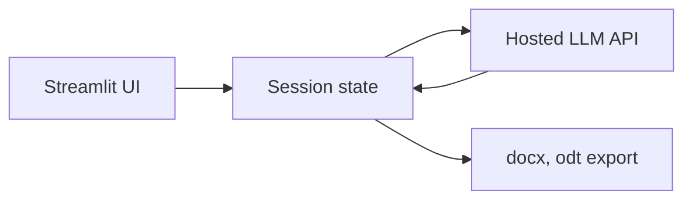

# Worked example: technical ICD

A worked example of the Innovation Canvas Document for a fictional but realistic technical innovation, run end-to-end from TRL -2 to TRL 4. The example is designed as teaching material and as a stress test of the framework. Read it alongside `innovation_canvas_document.md` to see how the structure plays out in practice. Names and numbers are illustrative and were not generated by real user research.

## Project at a glance

**Name.** Stipendia. A web tool that drafts grant applications for German freelance researchers in the humanities and social sciences. Working hypothesis: drafting is the bottleneck, not idea generation.

**Phase entry.** Phase 1. The team had a problem hypothesis and a rough user population, but no validated user need.

**Outcome.** Pivot at Phase 5. Original solution falsified at Phase 4. New direction: not drafting, but submission-deadline scheduling and structured collaboration with co-applicants.

## 1. Meta

### 1.1 Project identity

1. **Project name:** Stipendia
2. **One-sentence description:** A drafting assistant for German freelance researchers writing grant applications.
3. **Date initiated:** 2026-02-08
4. **Current phase:** 5 (closed)
5. **Team members and roles:** M. Maga (PI, vibe-coding lead). N. Becker (humanities domain). A. Petrov (UX research).

### 1.2 Constraints

1. **Time budget:** 12 weeks, part-time.
2. **Financial budget:** 800 EUR (mostly ad spend and API credits).
3. **Team size and composition:** 3 people, none full-time.
4. **Technical constraints:** Open source preferred. Hosted LLM API permitted for the prototype. Must run on Linux.
5. **Regulatory or policy constraints:** GDPR-compliant data handling. No storage of grant content beyond session unless explicit consent.
6. **Organizational constraints:** No external sponsor. Self-funded.

### 1.3 Uncertainty profile

1. Problem uncertainty: 4
2. User uncertainty: 3
3. Solution uncertainty: 4
4. Market uncertainty: 4
5. Technical uncertainty: 2
6. Execution uncertainty: 3

**Dominant uncertainty type:** problem
**Current TRL at entry:** -1
**Recommended entry phase:** 1

### 1.4 Innovation horizon

1. **Classification:** Horizon 1
2. **Rationale:** Existing tools cover writing assistance broadly. The novelty is the domain specialization, not the underlying capability.
3. **Implication for validation:** Tight thresholds. Real signups, real willingness to pay.

## 2. Situation map (lightweight: entry was Phase 1, so Phase 0 was abbreviated)

### 2.1 Strategic context

1. **Why now?** German freelance research funding has increased 18 percent over the past three years (BMBF figures). The administrative load on individual applicants is rising in parallel.
2. **Search fields:** Researcher productivity, grant infrastructure, AI writing tools.
3. **Signals and trends:** Increase in independent research budgets. Rise of LLM-based writing assistants. Growing complaint about administrative load in DFG and BMBF survey data.
4. **Strategic context summary:** Independent humanities researchers in Germany face rising grant volume but stagnant administrative support. LLMs are mature enough to draft structured documents in German with minimal correction. The opportunity is domain-specialized assistance that respects the conventions of German grant prose. Phase 5 must judge whether the bottleneck is drafting or something earlier in the workflow.

## 3. Problem space

### 3.1 User profiles (JTBD)

**User type:** Freelance humanities researcher, 35 to 55, Germany, EUR 30k to 60k annual revenue.

**Core JTBD:** When I am applying for a research grant, I want to produce a compelling first draft within a constrained week, so I can spend the remaining time on substantive revision and co-applicant coordination.

**Functional jobs:**

1. Convert a project idea into the formal structure of a DFG or BMBF application.
2. Translate informal notes into formal academic German.
3. Reuse content across multiple applications without copying errors.

**Emotional jobs:**

1. Reduce the dread of the blank document.
2. Feel competent in administrative German.

**Social jobs:**

1. Look professional to co-applicants and reviewers.

**Current workarounds:** Word documents copy-pasted from prior applications. Friends in academia for proofreading.

**Pains:** Time pressure. Switching between content thinking and administrative writing. Fragmented co-applicant communication.

**Gains:** A first draft in hours rather than days. Confidence that the structure is correct before substantive review.

### 3.2 Problem statement

**Sharp problem statement:** German freelance humanities researchers spend 25 to 40 percent of grant-application time on drafting in formal academic German, compared to substantive content development. Existing general-purpose AI assistants do not respect German grant conventions and produce drafts that need substantial restructuring before review.

**Problem type:** Complicated (Cynefin). Knowable best practices exist. The challenge is encoding them.

**Revision history:** Original statement (Phase 1): "Researchers spend too much time writing." Revised after Phase 4 user feedback: drafting was less of a bottleneck than scheduling and co-applicant coordination.

### 3.3 Assumption map

| ID | Assumption | Source | Crit | Unc | Score | Status | Evidence |
|---|---|---|---|---|---|---|---|
| A1 | Drafting takes 25 to 40 percent of application time | Phase 1 interviews (5 users) | 5 | 4 | 20 | Falsified | Phase 4 time-tracking pilot showed drafting at 12 to 18 percent. Scheduling and coordination consumed 35 percent. |
| A2 | Users would pay for domain-specialized drafting | Phase 1 | 5 | 5 | 25 | Falsified | Phase 4 Concierge: only 1 of 8 expressed willingness to pay above 5 EUR per month. |
| A3 | LLM can produce DFG-format drafts that pass first review | Phase 1 | 4 | 3 | 12 | Validated | Phase 4 Spike: 7 of 10 drafts judged acceptable structure by domain reviewer. |
| A4 | Researchers handle co-applicant coordination painfully | Phase 4 emergent | 5 | 4 | 20 | Validated | Phase 4 user feedback: 6 of 8 spontaneously raised coordination as the largest pain point. |
| A5 | A scheduling-and-coordination tool would have higher willingness to pay | Phase 4 emergent | 4 | 4 | 16 | Untested | To be tested in Phase 4 Pivot or Phase 1 re-entry. |

### 3.4 Effectuation inventory

1. **Who we are:** Two researchers and one UX practitioner with personal experience writing grants.
2. **What we know:** German academic conventions, grant structure, LLM prompting.
3. **Whom we know:** A network of 35 freelance researchers reachable for interviews and Concierge pilots.

## 4. Solution space

### 4.1 Idea candidates (Phase 2 abbreviated)

| ID | Idea | Method | F | D | V | Total | Status |
|---|---|---|---|---|---|---|---|
| I1 | Drafting assistant fine-tuned on DFG corpus | SCAMPER (Modify) | 4 | 4 | 3 | 11 | Selected |
| I2 | Structured outline generator with conventions glossary | Constraint injection | 4 | 4 | 3 | 11 | Selected |
| I3 | Co-applicant coordination dashboard | Persona rotation (PM lens) | 3 | 5 | 3 | 11 | Parked |
| I4 | Application-deadline planner with reverse scheduling | Domain transfer (Gantt) | 4 | 4 | 4 | 12 | Parked |
| I5 | Voice-to-grant draft via dictation | Speculative provocation | 3 | 3 | 2 | 8 | Killed |
| I6 | Plagiarism-aware reuse-from-prior-applications tool | SCAMPER (Reuse) | 4 | 3 | 3 | 10 | Parked |
| I7 | Reviewer-style feedback prompt | TRIZ (contradiction) | 3 | 4 | 3 | 10 | Parked |
| I8 | Grant-portfolio tracker | Domain transfer (CRM) | 4 | 3 | 3 | 10 | Parked |
| I9 | Anonymous community proofreading network | Persona rotation (peer lens) | 3 | 4 | 2 | 9 | Killed |
| I10 | Funder-database with auto-fill applications | TRIZ (system simplification) | 3 | 3 | 3 | 9 | Killed |

### 4.2 Selected concepts

**Concept name:** DraftAssist
**Description:** A Streamlit web app that takes a structured project outline plus uploaded prior applications and produces a DFG- or BMBF-format first draft. The user reviews, accepts, or rewrites each section. The tool tracks rewrite frequency to learn the user's voice.
**Key differentiator:** Domain-specialized prompts plus structured German academic conventions reference, neither of which appears in general-purpose tools.
**Riskiest assumption:** A2 (users would pay).

### 4.3 Value proposition canvas

**Customer profile.** Jobs: convert outline to formal draft. Pains: blank page, formal German, time pressure. Gains: first draft in hours, structural confidence.

**Value map.** Products: DraftAssist web app. Pain relievers: domain prompts, conventions glossary, voice tracking. Gain creators: structural skeleton, exportable output, GDPR-clean handling.

**Fit assessment:** Partial. Phase 4 evidence revised this to *low fit on drafting*, *high fit on coordination*.

### 4.4 Business model canvas

| Block | Description |
|---|---|
| Customer segments | German freelance humanities and social science researchers |
| Value propositions | First-draft acceleration with domain conventions |
| Channels | Direct (mailing lists of professional associations), institutional partnerships |
| Customer relationships | Self-service app, periodic email guides |
| Revenue streams | Subscription, 5 to 15 EUR per month |
| Key resources | Prompt library, conventions corpus, hosted LLM access |
| Key activities | Prompt engineering, conventions curation, user support |
| Key partnerships | Hosted LLM provider, professional associations |
| Cost structure | LLM API costs, hosting, part-time team |

### 4.5 Experiment design

| ID | Assumption | Pretotype | Metric | Threshold | Cost |
|---|---|---|---|---|---|
| E1 | A2 (willingness to pay) | Concierge pilot | Subscriptions accepted | At least 4 of 10 commit to paid | 60 hours, 200 EUR |
| E2 | A1 (drafting time share) | Time-tracking pilot | Percent of application time on drafting | At least 25 percent across 8 users | 80 hours, 100 EUR |
| E3 | A3 (LLM drafts pass review) | Spike | Drafts judged acceptable | At least 7 of 10 by domain reviewer | 30 hours, 150 EUR |

## 5. Validation space

### 5.1 Experiment results

| ID | Result | Threshold met? | Key learning | Implication |
|---|---|---|---|---|
| E1 | 1 of 8 committed | No | Willingness to pay for drafting alone is low. Users said "I would do this myself in less time than learning a new tool." | Pivot |
| E2 | 12 to 18 percent on drafting | No | Drafting is not the dominant time cost. Coordination and scheduling are. | Pivot |
| E3 | 7 of 10 drafts acceptable | Yes | Capability works. Demand does not. | Capability is reusable in pivot direction. |

### 5.2 Artifact specification (frozen at Phase 5 exit)

1. **Artifact type:** Prototype.
2. **Scope:** Drafting flow for DFG humanities applications. Excludes BMBF, EU, foundation-specific formats.
3. **Functional requirements:** The system must accept a structured outline (Validated). The system must produce a section-by-section draft in DFG format (Validated). The system must let the user accept, reject, or rewrite each section (Validated). The system must export to docx and odt (Validated).
4. **Non-functional requirements:** GDPR-compliant data handling, no storage of grant content beyond session (Validated). Latency below 8 seconds per section draft (Validated). German UI (Validated). Open-source self-hostable (Deferred).
5. **Technology stack and rationale:** Python, Streamlit, hosted LLM API. Throwaway stack. Decision log entry 2026-03-04.
6. **Architecture overview:** Single Streamlit app. Stateless session. LLM calls via hosted API. No backend database in the prototype.

7. **Data model:** Session-scoped only. No persistence in this prototype.
8. **External dependencies:** Hosted LLM API (single vendor). Streamlit. python-docx, python-odt.
9. **Known limitations:** Only DFG humanities format. No co-applicant view. No deadline tracking. No persistence.
10. **Open technical questions:** Which sections of an application are most valuable to draft and which the user prefers to write from scratch. How to evaluate draft quality without a reviewer in the loop. The pivot direction may require persistent state and multi-user access.
11. **Production readiness checklist.**

| Item | Status | Notes |
|---|---|---|
| Authentication and authorization | Out of scope | Single-session prototype |
| Input validation and error handling | Validated | Session-level error catch |
| Observability | Deferred | Streamlit logs only |
| Monitoring and alerting | Out of scope | |
| Deployment pipeline | Deferred | Manual deploy |
| Backup and disaster recovery | Out of scope | Stateless |
| Data protection and privacy compliance | Validated | No persistence, GDPR-clean by design |
| Accessibility conformance | Deferred | Streamlit defaults only |
| Performance and load behaviour | Out of scope | Single-user prototype |
| Documentation | Validated | README plus quickstart |

12. **Success criteria:** At least 4 of 10 users in the Concierge pilot commit to a paid version. *Threshold not met.*

### 5.3 Implementation log

1. **Repository:** prototype/ (local only, not published).
2. **Key files:** prototype/app.py, prototype/prompts/dfg_humanities.md, prototype/templates/section_draft.txt.
3. **User feedback summary:** 8 Concierge participants. 6 of 8 spontaneously raised coordination as their largest pain. Drafting itself was rated useful but not painful enough to pay for. Quote: "Schreiben ist nicht das Problem. Das Problem ist, mit drei Mitantragstellenden bis Donnerstag fertig zu werden."

## 6. Decision space

### 6.1 Gate decision

**Decision:** Pivot.
**TRL at decision:** 3 (artifact built and validated, but failed willingness-to-pay threshold).
**TRL change:** TRL 2 to TRL 3, then regressed to TRL 0 for the pivot direction.
**Reasoning:** A1 and A2 falsified. Capability (A3) is real and reusable. The user feedback identifies a different and larger pain (A4). The team has the resources to test the pivot direction within the remaining budget. Affordable-loss assessment supports a pivot rather than a kill.
**Dissenting views:** UX research lead noted that two interview participants did want a drafting tool and might be a niche. Recorded for future revisits. Not load-bearing for this decision.

### 6.2 Next actions

| Action | Owner | Deadline | Dependencies |
|---|---|---|---|
| Re-enter Phase 1 with new hypothesis: coordination is the bottleneck | M. Maga | 2026-04-30 | New JTBD round with 6 users from existing network |
| Park drafting capability code in archive branch with reuse notes | A. Petrov | 2026-04-25 | None |
| Retire prototype hosting | A. Petrov | 2026-04-25 | None |

### 6.3 Pivot record

**Original direction:** Drafting assistant for grant applications.
**New direction:** Coordination and scheduling tool for multi-applicant grant teams. Working title: Stipendia-Co.
**Evidence that triggered the pivot:** E1 result (1 of 8 willing to pay), E2 result (drafting is 12 to 18 percent of time, coordination is 35 percent), and 6 of 8 user-feedback quotes naming coordination as the largest pain.
**What we preserve from the original direction:** The conventions glossary (still useful inside a coordination tool). The user network (35 freelance researchers, willing to participate in further pilots). The DFG-format reviewer (now a Phase 4 reviewer for the pivot direction's content). The team's domain familiarity.

## 7. Iteration log

| Date | Loop type | From | To | Trigger | Scope | Outcome |
|---|---|---|---|---|---|---|
| 2026-03-12 | Intra-phase | Phase 4 Step 6 | Phase 4 Step 5 | E1 partial result suggested user need was elsewhere | Re-ran Step 5 with revised E2 design to capture coordination time | Revised E2 returned the falsifying number for A1. |
| 2026-04-02 | Intra-phase | Phase 5 Step 3 | Phase 5 Step 2 | Initial Go-or-Kill framing missed Pivot option | Re-read evidence with Pivot in scope | Pivot identified as best decision. |

**Iteration counters:**

| Phase | Iterations | Max |
|---|---|---|
| Phase 0 | 0 | 2 |
| Phase 1 | 1 | 2 |
| Phase 2 | 1 | 2 |
| Phase 3 | 0 | 2 |
| Phase 4 | 1 | 2 |
| Phase 5 | 1 | 2 |
| Total inter-phase loop-backs | 0 | 5 |

## 8. Decision log (selected entries)

| Date | Phase | Type | Decision | Alternatives | Rationale | Implications | Evidence |
|---|---|---|---|---|---|---|---|
| 2026-02-15 | 1 | Strategic | Focus on drafting bottleneck | Coordination, deadline tracking | Strongest signal in 5-user interviews | Phase 4 falsified | Interview notes 2026-02-10 to 2026-02-14 |
| 2026-03-04 | 4 | Technical | Streamlit plus hosted LLM API throwaway stack | Tauri, Vue plus FastAPI | Speed over polish for a one-question prototype | Pivot direction may require different stack | Phase 4 Step 3 entry |
| 2026-04-02 | 5 | Strategic | Pivot to coordination | Kill, Go, Loop-back to Phase 1 | E1 plus E2 plus user feedback unanimous | Phase 1 re-entry with new hypothesis | Phase 4 Section 5.1 |

## 9. Changelog

| Date | Phase | Changes |
|---|---|---|
| 2026-02-08 | Init | Initial creation |
| 2026-02-22 | 1 | Phase 1 output added |
| 2026-03-01 | 2 | Phase 2 output added |
| 2026-03-08 | 3 | Phase 3 output added |
| 2026-03-29 | 4 | Phase 4 output added, Section 5.2 populated |
| 2026-04-05 | 5 | Phase 5 decision recorded, executive summary generated |

## What this example illustrates

1. **Pivot is a first-class outcome.** The team did not waste 12 weeks. They learned that drafting is not the bottleneck and that coordination is, and they preserved the capability and the user network.
2. **Thresholds set upfront prevent retroactive goal-shifting.** E1's threshold (4 of 10) was set in Phase 3. When Phase 4 produced 1 of 8, the decision was mechanical.
3. **The assumption map carried the project.** A1 and A2 were named as the riskiest in Phase 3. They were also the ones falsified in Phase 4. The map and the experiments were aligned.
4. **The iteration log shows discipline.** Two intra-phase iterations, zero inter-phase loop-backs. The team moved when it had to and not before.
5. **The exec summary will be a Pivot summary, written with the same care as a Go summary.** Negative results are evidence.
