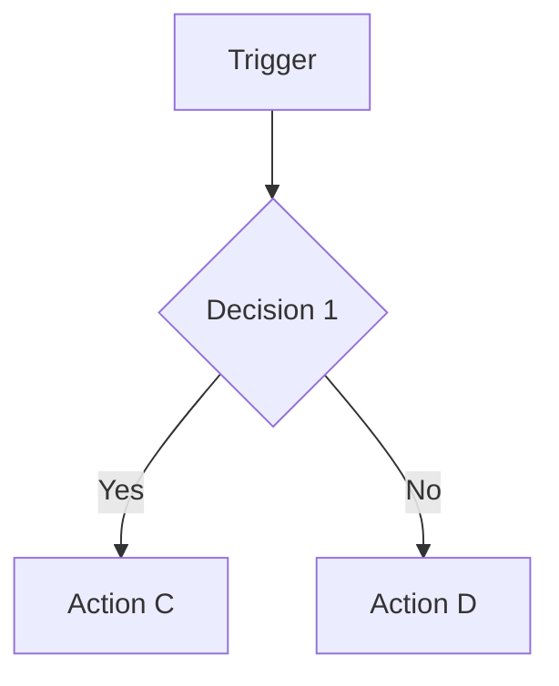
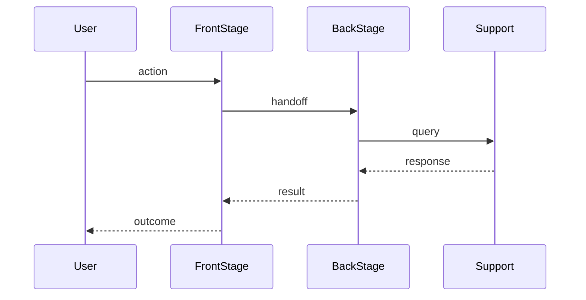

# Institutional templates

Skeletal templates for institutional artifacts produced in Phase 4 when the innovation is non-technical (a protocol, a pilot design, a service blueprint, a policy draft, a training program, a process). The technical-artifact branch of Phase 4 has the `prototype/` directory plus the streamlit and python rules. This document is the institutional-branch counterpart.

The templates below are deliberately minimum-viable. They cover the structural fields a Phase 4 institutional artifact must populate to be a valid handoff at TRL 3 or 4, mapped to the 12 fields of ICD Section 5.2 (Artifact specification). Do not bloat them. The Maker persona retires beautiful broken artifacts.

## Format conventions

1. All templates are Pandoc Markdown. UTF-8. No diacritics in filenames. Sentence case for headings.
2. Diagrams are Mermaid (`flowchart`, `sequenceDiagram`, `stateDiagram`, `gantt`). The framework assumes Mermaid availability. If Mermaid is unavailable, fall back to plain-text process descriptions.
3. Numbered lists only.
4. Date stamps follow CalVer ISO 8601 with timezone.
5. Filename conventions: `protocol_<short_name>.md`, `pilot_<short_name>.md`, `blueprint_<short_name>.md`, `policy_<short_name>.md`, `program_<short_name>.md`.
6. Each template has a YAML frontmatter block at the top with metadata.

## Template 1: Protocol

A protocol describes a sequence of actions that an operator (clinician, support agent, facilitator, ranger, librarian) follows in a defined situation. Used for clinical pathways, ethical decision protocols, incident response, customer service flows.

```markdown
---
title: [Protocol name]
type: protocol
version: YYYY-MM-DDThh:mm:ss+hh:mm
icd_section: 5.2
trl: [3 or 4]
status: [draft, validated, frozen]
owner: [name and role]
---

# [Protocol name]

## Purpose

One paragraph. What does this protocol exist to accomplish? Who triggers it, who runs it, what outcome is the success state?

## Scope

In scope and out of scope. Explicit. Two short numbered lists.

## Roles

| Role | Responsibility | Authority | Backup |
|---|---|---|---|
| | | | |

## Trigger

The exact event or condition that starts the protocol. Falsifiable. "Patient presents with X" or "Incoming ticket tagged Y" or "Stakeholder Z requests action W."

## Steps

A numbered list. Each step has actor, action, decision criterion, and expected duration. Use a Mermaid flowchart for any branch with two or more decision points.



1. **Step 1.** Actor: [role]. Action: [verb]. Decision criterion: [observable]. Duration: [time].
2.

## Mandatory checks

A short numbered list of checks that must be performed and recorded at each defined point. Mandatory means *always*. If a check is sometimes skipped, it does not belong here.

## Records and artifacts

What documents, signals, or measurements does this protocol produce, consume, and retain? Map to ICD Section 5.2 field 7 (Data model or artefact and record model).

## Escalation

When does the operator stop running this protocol and route to whom? Falsifiable conditions only.

## Failure modes and recovery

The top three known failure modes. For each: detection signal, immediate recovery action, post-incident logging requirement.

## Open questions

Items the institutional owner must resolve before reaching TRL 5. Map to ICD Section 5.2 field 10.

## Validation status

| Field | Status | Evidence |
|---|---|---|
| Operator can run end-to-end | Validated, Assumed, or Deferred | |
| Edge-case handling | | |
| Outcome under load | | |
| Cultural fit and acceptance | | |
| Auditability | | |

## Decision log reference

Cross-references to ICD Section 8 entries that recorded load-bearing decisions for this protocol.

| Date | Decision ID | Summary |
|---|---|---|
| | | |
```

## Template 2: Pilot design

A pilot design specifies an end-to-end run of an institutional artifact at small scale, including measurement and decision rules. Used as the artifact specification when Phase 4 chooses the pilot-cohort method from `validation_methods.md`.

```markdown
---
title: [Pilot name]
type: pilot
version: YYYY-MM-DDThh:mm:ss+hh:mm
icd_section: 5.2
trl: [3 or 4]
status: [draft, running, completed]
owner: [name and role]
---

# [Pilot name]

## Hypothesis under test

One sentence. The single load-bearing assumption this pilot is designed to falsify. Cross-reference to ICD Section 3.3 (Assumption map).

## Success threshold

Pre-committed numeric threshold. Falsification rule. Format: "If [metric] is below [value] in [population] over [duration], the assumption is falsified."

## Cohort

| Field | Value |
|---|---|
| Population | |
| Inclusion criteria | |
| Exclusion criteria | |
| Sample size | |
| Recruitment channel | |
| Compensation or incentive | |

## Setting

Where the pilot runs. Site, time of day, season, organizational unit. Constraints that could affect generalization.

## Measurements

| Metric | Instrument | Cadence | Owner |
|---|---|---|---|
| | | | |

Pre-committed before the pilot starts. No retroactive metrics.

## Process

A numbered list of pilot phases (recruitment, baseline measurement, intervention, follow-up, debrief). Each phase has start date, end date, and gate criterion.

## Ethics and consent

Consent process, data handling, withdrawal procedure, adverse-event reporting. Map to ICD Section 5.2 field 4 (Non-functional requirements).

## Risk register

Top three risks, each with probability, impact, and mitigation.

## Decision rules

What happens at the threshold check. Three branches:

1. **Above threshold:** [next action].
2. **Below threshold:** [next action]. Includes the kill condition.
3. **Inconclusive (insufficient power):** [next action]. Specify the minimum effective sample.

## Open questions

Map to ICD Section 5.2 field 10.

## Production readiness checklist

Same 10 items as the technical artifact specification, reinterpreted for the institutional domain. See `innovation_canvas_document.md` Section 5.2 field 11 for the mapping (for example, *Authentication and authorization* maps to *access and consent mechanisms*).

| Item | Status | Notes |
|---|---|---|
| Access and consent mechanisms | Validated, Deferred, or Out of scope | |
| Input validation and error handling (data quality, intake forms) | | |
| Observability (process logs, decision records) | | |
| Incident and escalation channels | | |
| Deployment pipeline (rollout plan, training schedule) | | |
| Backup and disaster recovery (continuity plan) | | |
| Data protection and privacy compliance | | |
| Accessibility conformance | | |
| Performance and load behaviour (throughput at peak) | | |
| Documentation (operator guide, user-facing materials) | | |
```

## Template 3: Service blueprint

A service blueprint maps the user-facing journey alongside the operator-facing actions, the supporting processes, and the artifacts that flow between them. Used for service design, customer experience design, end-to-end institutional services.

```markdown
---
title: [Service name]
type: service-blueprint
version: YYYY-MM-DDThh:mm:ss+hh:mm
icd_section: 5.2
trl: [3 or 4]
status: [draft, validated, frozen]
owner: [name and role]
---

# [Service name]

## Service summary

One paragraph. Whom does this service serve, what outcome does it produce, and what makes it distinct from the alternatives the user already has?

## User journey

A numbered list of phases the user experiences. For each phase: user goal, user action, user emotion, touchpoint.

## Front-stage actions

What operators do that the user can see. Map to user-journey phases.

## Back-stage actions

What operators do that the user cannot see. Map to front-stage actions.

## Supporting processes

Internal processes (IT systems, partners, third parties) that enable the back-stage actions.

## Swimlane diagram



## Pain points and moments of truth

The phases where the service most often fails or where user perception is set. For each: what fails, what would success look like, what evidence supports the diagnosis.

## Boundaries

Where does this service start and end? What does it explicitly not cover?

## Validation status

| Phase of journey | Validated | Assumed | Deferred |
|---|---|---|---|
| | | | |

## Open questions

Map to ICD Section 5.2 field 10.
```

## Template 4: Policy draft

A policy draft codifies a decision rule or governance constraint that the organization will adopt. Used for institutional policy, internal governance, ethical guidelines, regulatory drafts.

```markdown
---
title: [Policy name]
type: policy
version: YYYY-MM-DDThh:mm:ss+hh:mm
icd_section: 5.2
trl: [3 or 4]
status: [draft, consultation, adopted, superseded]
owner: [name and role]
---

# [Policy name]

## Purpose

One paragraph. What problem does this policy address, and why is a policy the right instrument (rather than a protocol, a tool, or a training)?

## Scope

In scope and out of scope. Population, domain, time window.

## Definitions

Terms used in this policy with non-standard or load-bearing meanings.

## Provisions

A numbered list. Each provision has a subject (who), an obligation (must, should, may), and a verifiable predicate.

1. **Provision 1.** [Subject] **must** [action] when [condition]. Verification: [evidence required].
2.

## Exceptions and waivers

Any case where the provisions do not apply. Authority to grant a waiver, conditions, expiration.

## Compliance and audit

How compliance is verified. Evidence required, audit cadence, sanction for non-compliance.

## Sunset and review

Date of next mandatory review. Conditions that would trigger an earlier review.

## Stakeholder consultation log

| Date | Stakeholder | Input | Disposition |
|---|---|---|---|
| | | | |

## Validation status

| Field | Status | Evidence |
|---|---|---|
| Provisions are unambiguous | Validated, Assumed, or Deferred | |
| Stakeholder buy-in | | |
| Compliance is feasible | | |
| Audit mechanism exists | | |

## Open questions

Map to ICD Section 5.2 field 10.
```

## Template 5: Training program

A training program specifies how operators are prepared to run a protocol or service. Used when the limiting factor on Phase 4 validity is the operator population's familiarity with the artifact.

```markdown
---
title: [Program name]
type: training-program
version: YYYY-MM-DDThh:mm:ss+hh:mm
icd_section: 5.2
trl: [3 or 4]
status: [draft, piloted, frozen]
owner: [name and role]
---

# [Program name]

## Learning objectives

A numbered list. Each objective is observable and assessable. "Operator can run protocol X end-to-end on a synthetic case in T minutes with no missed mandatory checks."

## Audience

Who is the trainee? Prior knowledge expected, prior knowledge not expected.

## Curriculum

| Module | Topic | Duration | Format | Assessment |
|---|---|---|---|---|
| | | | live, async, blended | quiz, roleplay, observed run |

## Assessment

How is competence verified before deployment? Pre-committed pass criteria.

## Materials

What artifacts the program produces (slides, handouts, scenario decks, video). Storage location, version, license.

## Trainer requirements

Who can deliver this program? Prerequisites, certification path, train-the-trainer plan.

## Validation status

| Field | Status | Evidence |
|---|---|---|
| Trainee competence after program | Validated, Assumed, or Deferred | |
| Retention at 4 weeks | | |
| Trainer scalability | | |

## Open questions

Map to ICD Section 5.2 field 10.
```

## How these templates map to ICD Section 5.2

| ICD Section 5.2 field | Template field |
|---|---|
| 1. Artifact type (Spike, Prototype, MVP) | `trl` plus `type` in frontmatter |
| 2. Scope | Scope section |
| 3. Functional requirements | Provisions, Steps, Process |
| 4. Non-functional requirements | Ethics and consent, Compliance and audit, Validation status table |
| 5. Technology stack and rationale (or method and medium stack) | Frontmatter, Materials, Trainer requirements |
| 6. Architecture overview (or process architecture) | Swimlane diagram, Steps, Curriculum |
| 7. Data model (or artefact and record model) | Records and artifacts, Materials |
| 8. External dependencies | Supporting processes, Trainer requirements, Stakeholder consultation log |
| 9. Known limitations | Boundaries, Failure modes, Exceptions |
| 10. Open technical questions | Open questions section |
| 11. Production readiness checklist | Production readiness checklist (pilot template) or Validation status table |
| 12. Success criteria | Success threshold (pilot), Learning objectives (program), Provisions (policy) |

## Boundaries

1. These templates are skeletons, not finished artifacts. Each pilot will need adaptation.
2. The templates are minimum-viable for TRL 3 or 4. Production-grade institutional artifacts (TRL 5 and above) require additional structure that is out of scope for the framework.
3. The frontmatter `version` field is mandatory and follows CalVer per the global conventions in `CLAUDE.md`.
4. Validation status fields use the same Validated, Assumed, Deferred markers as the technical artifact specification, for consistency.
